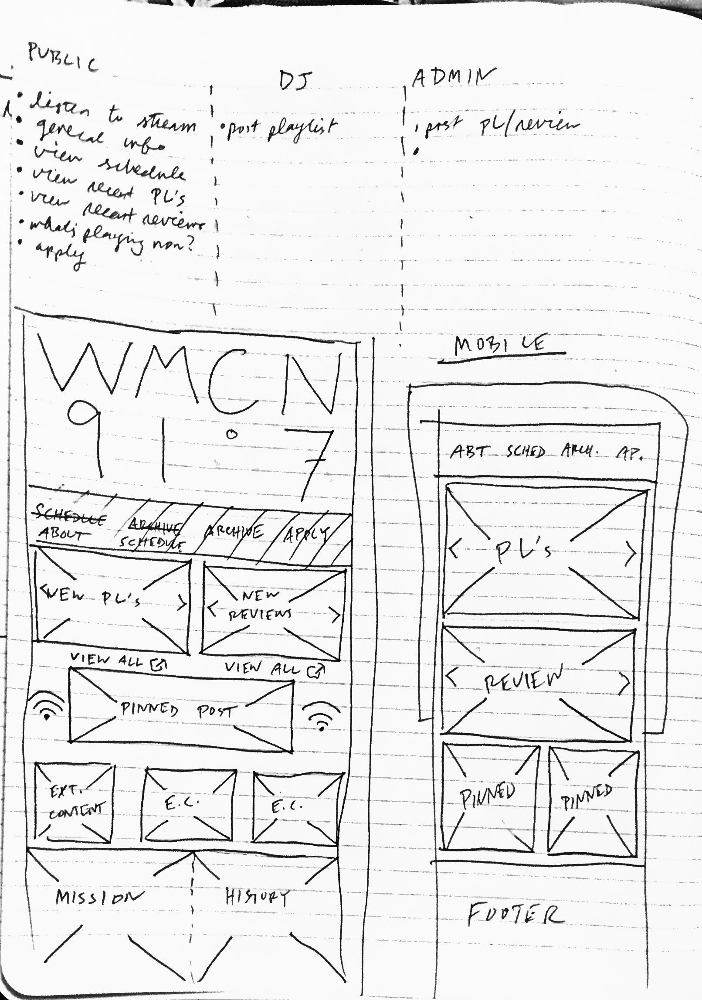

###Will Kent-Daggett
###Spring 2015 COMP-614 Indepdent Study
###February 17th weekly update

---

This week I completed the two remaining ASAP items in the to-do list: adding the schedule to the homepage and adding a password reset feature for users who don't want to look up their random alphanumeric string every time they log in to the site ([commit](https://github.com/wmcn-fm/wmcn/commit/6758f05c03367b6335d472c615d264ab71769daa) [links](https://github.com/wmcn-fm/wmcn/commit/050d3b9021657cb720cb9822e1c968e8cbb7ce60)). I wound up just serving the schedule as a pdf instead of wasting time writing code that I will overwrite during this project. Also, the password reset feature (only visible to those with login access) is a route on its own right now, but in the near future it will be wrapped in to a page where the user can edit each of their own info items (name, email, etc etc) in addtion to the password. 

I also started sketching some very very rough wireframes of the site homepage to get an idea of how the HTML route structure will vary from the API JSON route structure. One example: already, it seems clear to me that playlists, reviews, and all other posts should be grouped under the "archive" header to avoid clutter on the navbar. If a user clicks on that button (directing them to `wmcn.fm/archive`), posts should be filterable by type (`wmcn.fm/archive/playlists, ~/reviews` et al). For simplicity's sake, the API doesn't need to have the archive tag, it could look more like: `api.wmcn.fm/playlists`. 

Finally, I decided that this is a good project to start practicing test-driven development, so I started writing some basic tests for the API using Mocha.js, which I will push to the API repo when they're finished.

