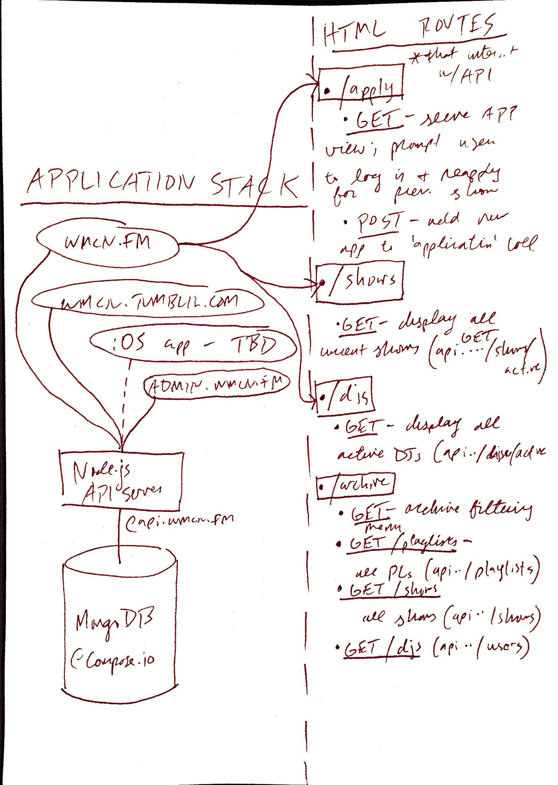

###Will Kent-Daggett
###Spring 2015 COMP-614 Indepdent Study
###February 24th weekly update

---

This week I seriously began the process of making the API, starting with the documentation. I completed the basic API documentation - methods for the main user, show, playlist, and application objects. I'm trying to employ some of the good developer practices that I'm learning about in COMP-225, which I'm currently enrolled in, since I think my ignorance of best programming practices when I started making this site got me into the position I'm in now, having to rewrite the whole thing essentially from scratch due to poorly modularized spaghetti code. So, I'm proceeding using a minimum viable product type approach, with the idea being that at each step of development, I'm producing something that works, in service of some minimum goal - in this case, keeping a table of users and their shows, and allowing users to create playlists for these shows, as well as apply to gain entry to the whole system. For now, I have documentation for this minimum product, as well as a series of tests that the API should pass once I have actually built these routes ([commit link](https://github.com/wmcn-fm/wmcn-api/commit/8d863fe2fa1ff78871b5c0f52b766fcdf0e211c0) - weirdly, the markdown file that contains the documentation thus far displays fine on my system editor but is broken on [github](https://github.com/wmcn-fm/wmcn-api/blob/master/docs/wmcn_api_0.1_documentation.md), so I've added the PDF [here](https://github.com/wmcn-fm/wmcn-api/blob/master/docs/wmcn_api_0.1_documentation.pdf?raw=true) ).

I had planned on having the documentation (and maybe even tests, too) completed for *all* of the API by today, but in the process of creating this minimal documentation and sketching out how the HTML client (wmcn.fm) will access it, I realized that I need to take a step back and re-examine the database architecture. I used MongoDB on this project because it seemed popular among Node developers, had great documentation, and the schema-less approach made more intuitive sense to me as someone with no other database experience. I hadn't planned on switching databases on this implementation, but in 225, we are thinking of implementing a PostgreSQL server, on a project which has much fewer relations among database objects than this one. So, I've revised the schedule to have the new documentation (possibly including a new application stack) completely finalized by next week, and everything else pushed back a week in the semester. I've attached my sketch of the application stack and its partial conversion into HTML routes below:

