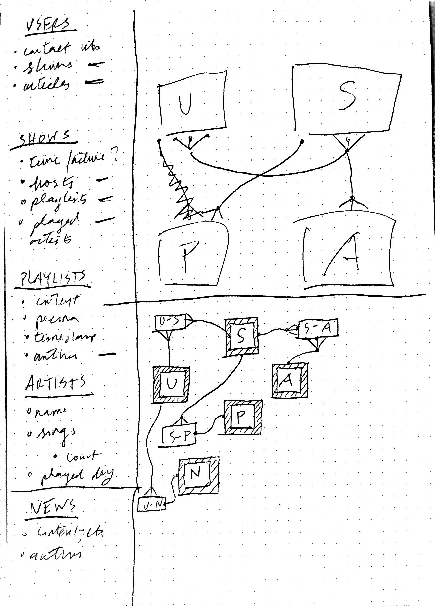
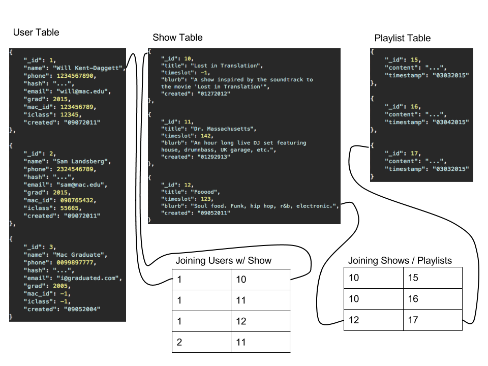

###Will Kent-Daggett
###Spring 2015 COMP-614 Indepdent Study
###March 5th weekly update

---
####Progress update:
This week I completed the API documentation, diagrammed a database schema, sketched out a sitemap for the main API client (wmcn.fm), and added pseudocode for the actual API, which I will have completed before spring break.

* the updated API markdown file is available in the [same place](https://github.com/wmcn-fm/wmcn-api/blob/master/docs/wmcn_api_0.1_documentation.md), but it still doesn't render properly. I wrote the file in the Mou markdown editor - where it renders properly - so to view the update docs I'd suggest using that
* General outline of the overall DB schema: 
* ...and a detailed look at the most important section of the database: the user-show-playlist relationship, which I will focus on as the MVP of this project: 
* [Commit link on the API repo](https://github.com/wmcn-fm/wmcn-api/commit/ab92ff5480828b8c3b5c5251b20afbfde459b5a5)

####Remaining questions:
Pretty much my only big remaining question is: what database should I use? Or even more generally, should I continue to use MongoDB, which the site is built on at the moment, or should I switch to a relational database? The second diagram I've included here is modeled on the assumption that I'd be working with a relational database. The join relationships still exist in the current iteration of the site, but they're represented as "references" to the other tables, like so:

```
#User Table: 

{
	"name": "Will Kent-Daggett",
	"_id": 1,
	"shows": [10, 11, 12]
}
...

#Show Table:

{
	"_id": 11,
	"title": "Dr. Massachusetts",
	"hosts": [1, 2]
}
...
```

This method has been working ok for me so far, but I can see that it will result in more and more messy manual joins as the site expands, and it will hamper some of the additional functionality which I'm planning on adding - cross-referencing users and shows and articles, etc. Basically the question is whether it would be worth the time to learn a new database (Postgres?) weighed against the trade-offs of keeping a suboptimal database underlying the whole project...